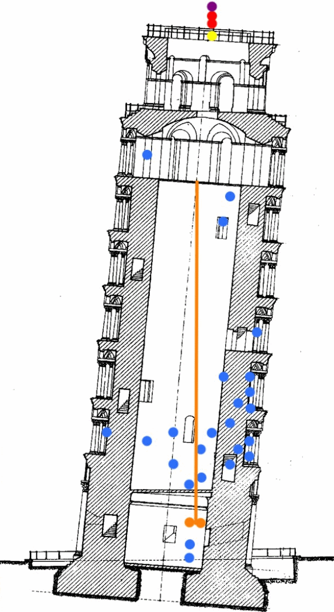

# **torre-transformer**
Repository containing code to monitor the leaning tower.

If you want to read the full article you can find it on [SciTePress](https://www.scitepress.org/PublicationsDetail.aspx?ID=hJHQbC/Fc00=&t=1)


 


If you find the work useful, please mention it as follows
```
@conference{ncta22,
    author={Mario G. C. A. Cimino. and Federico A. Galatolo. and Marco Parola. and Nicola Perilli. and Nunziante Squeglia.},
    title={Deep Learning of Structural Changes in Historical Buildings: The Case Study of the Pisa Tower},
    booktitle={Proceedings of the 14th International Joint Conference on Computational Intelligence - NCTA,},
    year={2022},
    pages={396-403},
    publisher={SciTePress},
    organization={INSTICC},
    doi={10.5220/0011551800003332},
    isbn={978-989-758-611-8},
    issn={2184-2825},
}
```